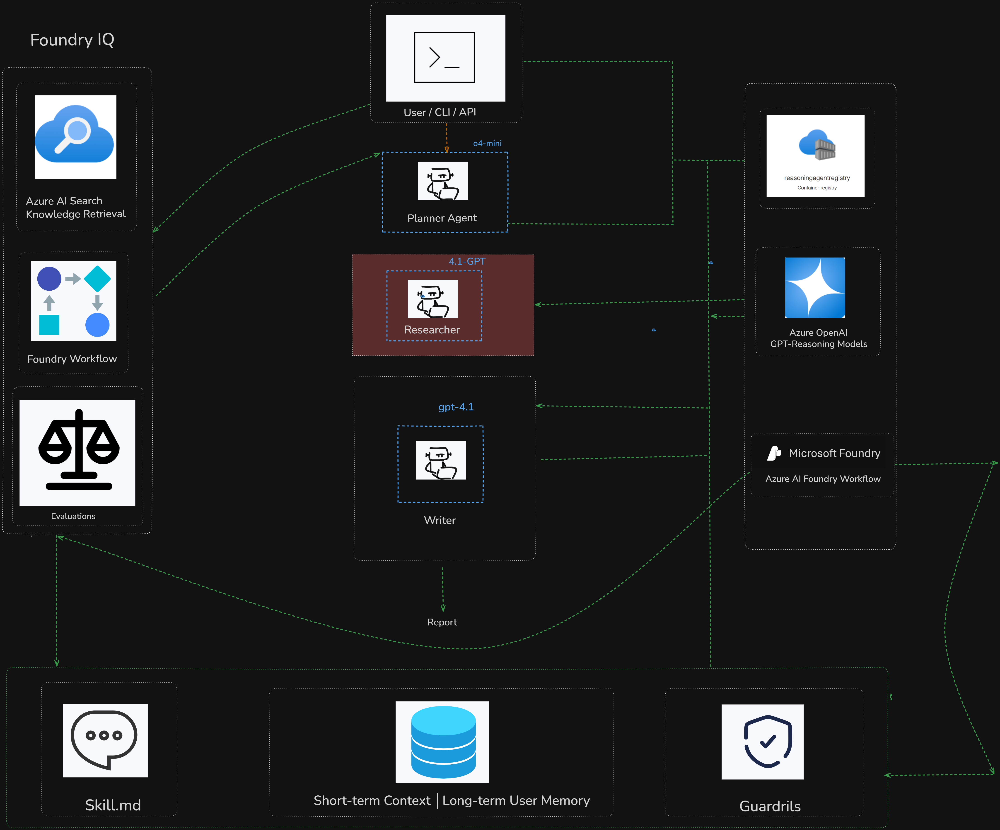
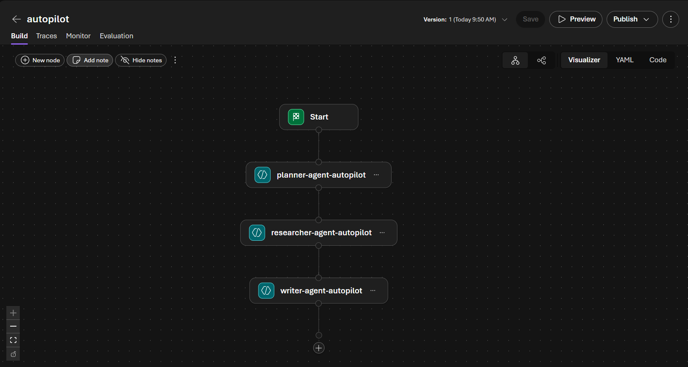
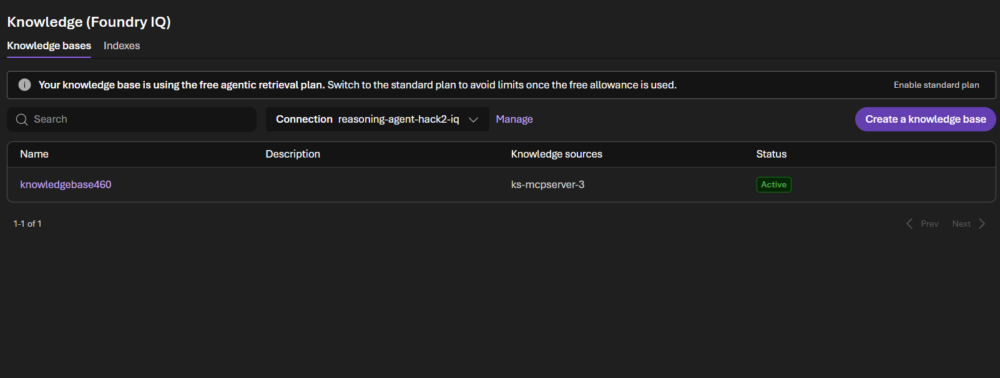
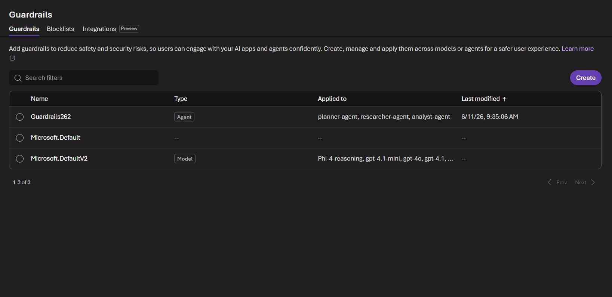

# AUTOPILOT: AI-Powered CLI Task Automation Agent

AutoPilot is a production-grade, multi-agent terminal automation system built on **Microsoft Azure AI Foundry**. It is designed to assist software developers, system administrators, and DevOps engineers in executing complex or repetitive terminal tasks safely and efficiently by converting natural language queries into verified, risk-assessed shell commands.

---

## Technical Architecture Overview

AutoPilot implements a sequential, context-accumulating multi-agent pipeline composed of three specialized reasoning agents. The system utilizes Microsoft Azure AI Foundry's model orchestration layer, stateful agent runtime, and Azure AI Search knowledge base grounding to deliver highly precise and secure terminal execution workflows.

```
                         [ User Query / CLI ]
                                  │
                                  ▼
                    [ SQLite Persistent Memory Load ]
                                  │
                                  ▼
                   [ Human-in-the-Loop Clarification ]
                                  │
                                  ▼
                     [ Azure AI Foundry Workflow ]
                                  │
         ┌────────────────────────┼────────────────────────┐
         ▼                        ▼                        ▼
    Planner Agent         Researcher Agent           Writer Agent
   (Decomposition)     (Azure AI Search Grounding)  (Execution Plan)
         │                        │                        │
         └────────────────────────┼────────────────────────┘
                                  │
                                  ▼
                    [ Command Risk Guardrails ]
                                  │
                                  ▼
                   [ User Execution Confirmation ]
                                  │
                                  ▼
                     [ Safe Shell Execution ]
                                  │
                                  ▼
                    [ SQLite Persistent Memory Sync ]
```

---

## Core Features and Capabilities

*   **3-Agent Sequential Execution Pipeline**: Orchestrates distinct stages (Planner, Researcher, and Writer) to go from natural language to verified shell commands.
*   **Azure AI Foundry Integration**: Uses the Azure AI SDK (`AIProjectClient`) to run agent sessions and coordinate LLM runs.
*   **Azure AI Search Grounding**: Integrates the project's Azure AI Search knowledge base with the Researcher agent to fetch accurate, authentic CLI syntax.
*   **Risk-Aware Command Guardrails**: Assesses command risk (`safe`, `moderate`, `dangerous`) and automatically blocks dangerous/destructive actions (e.g., recursive deletes, formatting) by default.
*   **Interactive REPL & CLI**: A sleek, user-friendly interactive console utilizing Rich-formatted tables, colored output, and spinners.
*   **Human-in-the-Loop (HITL) Clarification**: Proactively asks clarifying questions when tasks are ambiguous before generating the final plan.
*   **SQLite Persistent Memory & History**: Logs execution history, task metadata, and results in a local SQLite store (`history.db`).
*   **OS and Shell Auto-Detection**: Auto-detects whether the user is on Windows (PowerShell/CMD), macOS (zsh), or Linux (bash) and adapts the commands accordingly.

---

## Agent Persona and Character Design

The workflow divides responsibilities among three specialized agents, each fine-tuned with specific system instructions:

1.  **Planner Agent** (`Planner Agent`): Decomposes the user's natural language goal into small, logical, ordered steps described in plain English. It estimates execution steps and outlines tasks without drafting code/commands.
2.  **Researcher Agent** (`Researcher Agent`): Takes the steps from the Planner and queries the Azure AI Search Knowledge Base to find the exact, correct command and flags. Evaluates individual step risk.
3.  **Writer Agent** (`Writer Agent`): Aggregates the researched commands, eliminates duplicates, chains related operations (using `&&`), and builds the final JSON execution plan with warnings and an overall risk assessment.

---

## Documentation Index

Detailed design specs, execution logs, and guides are organized within the repository:

*   **[Agent Prompts Reference](file:///c:/Users/RAJ/Desktop/AutoPilot/context.md)**: Breakdown of instructions, roles, and JSON schema structures for Planner, Researcher, and Writer agents.
*   **[Problem Statement](file:///c:/Users/RAJ/Desktop/AutoPilot/problem_stmt.md)**: Hackathon specification, objectives, pain points, and target user demographics.

---

## Quick Start & Installation

### Local Developer Installation

AutoPilot can be installed in editable developer mode to modify source files:

```bash
# Clone the repository
git clone https://github.com/your-username/AutoPilot.git
cd AutoPilot

# Create and activate a virtual environment
python -m venv .venv
source .venv/bin/activate  # Windows: .venv\Scripts\activate

# Install dependencies and editable package
pip install -e ".[dev]"
```

### CLI Command Execution

```bash
# Launch the interactive terminal shell (REPL)
autopilot

# Execute a query directly and run the pipeline
autopilot -t "set up a new Python project with a virtual environment"

# Bypass clarifying questions
autopilot --no-hitl -t "create a folder named test_dir"

# Reconfigure Azure AI Foundry endpoints
autopilot setup

# View past tasks execution history
autopilot history
```

### Checking Configuration & Memory

AutoPilot stores configurations locally in your home directory:
- **Configuration Path**: `~/.autopilot/config.json`
- **History Database Path**: `~/.autopilot/history.db`

You can view details or configure settings directly through the CLI tool:
- Type **`history`** inside the interactive shell to review the customized profile and command logs.
- Type **`setup`** inside the interactive shell to configure the Foundry client settings.
- Type **`clear history`** to wipe your local SQLite database clean.

---

## System Verification & Proof of Concept

This section showcases the system validation runs, visual workflow layouts, and safety guardrails of the AutoPilot agent.

### 1. System Architecture

*A high-level design diagram depicting the multi-agent execution pipeline (Planner, Researcher, Writer), human-in-the-loop (HITL) prompt gates, and SQLite-backed memory store.*

### 2. Azure AI Foundry Workflow

*The visual orchestration layout of the 3-agent pipeline (Planner Agent → Researcher Agent → Writer Agent) as defined in the Azure AI Foundry portal.*

### 3. Azure AI Search (Knowledge Base)

*Confirms the connection of the multi-agent system to the project's Azure AI Search knowledge base, allowing the Researcher agent to fetch accurate, grounded command syntax.*

### 4. Input & Output Guardrails

*Demonstrates AutoPilot's safety engine dynamically categorizing command risks (Safe, Moderate, Dangerous) and blocking destructive CLI commands by default.*

---

## License

MIT License — see [LICENSE](LICENSE)
